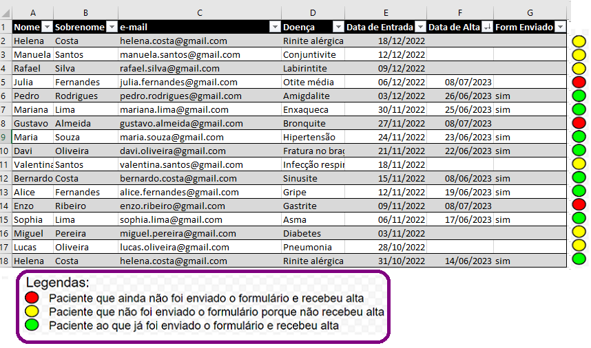
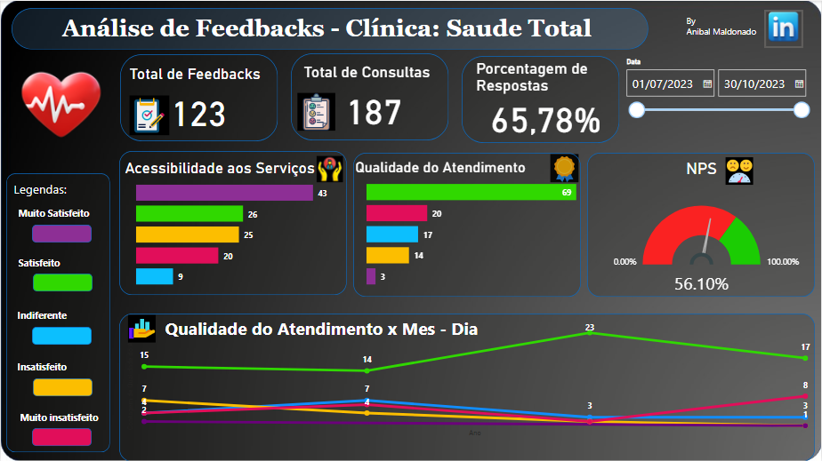

# Pesquisa-de-Satisfação-com-Power-Automate

## Resumo
Os principais objetivos da pesquisa de satisfação são avaliar a qualidade dos serviços de saúde prestados, medir a satisfação dos pacientes em relação ao atendimento recebido e identificar áreas de melhoria.

Para isso, é utilizado o Google Forms como plataforma de pesquisa online, criando um questionário conciso e fácil de responder. Um novo fluxo de trabalho é configurado no Power Automate, sendo acionado pelo horário programado para consultar a planilha de prontuários no Excel. Se houver registro de alta médica, o Power Automate envia um e-mail personalizado ao paciente com o link do formulario.

As respostas coletadas são integradas em um Google Sheets e, em seguida, são processadas no Microsoft Power BI. Após um processo de ETL (Extração, Transformação e Carga) dos dados, eles são apresentados em um Dashboard, permitindo a extração de insights e análise dos resultados da pesquisa de satisfação.

## O processo de automação é uma combinação de tecnologias e ocorre da seguinte maneira:

A versão gratuita do Power Automate Desktop não oferece suporte ao agendamento de execuções. No entanto, uma solução alternativa foi executar automaticamente um robô todos os dias ao meio-dia por meio do Agendador de Tarefas do Windows. O robô é programado em Python usando a biblioteca PyAutoGUI para abrir e executar o fluxo no Power Automate Desktop.

A clínica "Saúde Total" possui uma planilha em Microsoft Excel com os dados dos pacientes internados. Ao executarse o fluxo, o Microsoft Power Automate consulta essa planilha, se nenhum paciente recebeu alta o fluxo termina porém, se algum paciente recebeu alta O Power Automate envia um e-mail personalizado para o paciente com um link para um formulário de feedback do atendimento, criado no Google Forms.

As respostas do formulário preenchem uma planilha do Google Sheets, que está conectada ao Microsoft Power BI para apresentar os resultados em um Dashboard.

O Dashboard feito inclui dados como o Net Promoter Score (NPS), a quantidade de pacientes que receberam o e-mail, a quantidade de pacientes que responderam o formulário e a porcentagem de respostas. Além disso, são apresentados gráficos sobre a qualidade do atendimento e a acessibilidade aos serviços, pudendo todos os dados serem filtrados por datas em que foram recebido os Feedbacks.

# Prontuario

O prontuario em Excel contem os seguintes dados de cada paciente:

- Nome: Nome do paciente
- e-mail: e-mail do paciente
- Doença: diagnóstico do paciente
- Data de Entrada: data em que o paciente foi internado
- Data de Alta: caso o paciente tenha sido dado de alta este campo terá essa data
- Form Enviado: se ao paciente foi enviado o formulario tem o valor "sim" caso contrario o campo estará vazio

Na seguinte imagem é apresentada uma amostra do prontuario indicando com cores a situação de cada paciente

# Formulário

O formulario elaborado com Google Forms que receberá cada paciente depois de ter alta médica contem as seguintes questões:
- Qualidade do Atendimento
- Acessibilidade aos Serviços
- Em uma escala de 0 a 10, o quanto você recomendaria nossa instituição para um amigo ou familiar?
- Feedback
- Sugestões de melhorias

A seguinte imagem é uma amostra do formulário que se encontra no seguinte [link]( https://forms.gle/oMfejxLoXWriz8Jy5)

# Robô

Para funcionar o robô que executara o fluxo no Power Automate é necessario a biblioteca PyAutoGUI instalada 

Para saber onde o mouse tem que fazer click no Power Automate para iniciar o fluxo abrimos o Power Automate e com este código descobrimos essa posição

O código da um tempo de 5 segundos de espera até capturar a posição do mouse, em esse tempo o mouse temos que posicionar no botão de executar o fluxo

O programa feito em Python será executado pelo arquivo do sistema python.exe, com este código descobrimos onde fica no computador para indicar no Agendador de Tarefas do Windows como executar o robô

Finalmente o código do robô que o que faz é abrir o Power Automate Desktop e posteriormente faz Click na posição do botão que executa o fluxo. O código é salvo com o nome ExecutaFluxo.py e adicionado seu nome com a localização no Agendador de Tarefas

# Fluxo no Power Automate

# Dashboard
[link](https://app.powerbi.com/reportEmbed?reportId=1f77ef68-cfc1-456b-943c-24ed59641a90&autoAuth=true&ctid=8f10e124-8279-4297-9805-457da5eea6f1)

